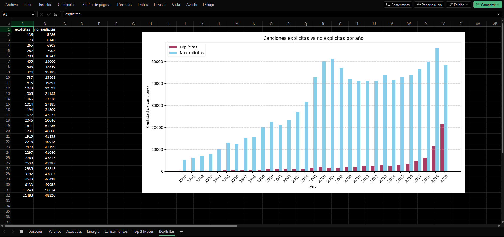

# Análisis de Canciones con Datos de Spotify

Este proyecto realiza un análisis exploratorio y visual de un conjunto de datos de canciones provisto por Spotify. Busca responder preguntas clave sobre la duración, el tono emocional (valence), la presencia de letras explícitas, las tendencias acústicas y los patrones de lanzamiento de la música a lo largo del tiempo.

Por limitaciones de GitHub, el dataset completo (345 MB) no se incluye, pero el análisis fue realizado localmente sobre el conjunto completo.

📁 Puede descargarse el dataset completo desde: [Spotify Tracks Dataset (Kaggle)](https://www.kaggle.com/datasets/rodolfofigueroa/spotify-12m-songs?resource=download)

---

## 🔍 Características

* Análisis de duración, energía, valence y otras métricas musicales por año.
* Identificación de los meses con más lanzamientos musicales.
* Comparativa de canciones explícitas vs. no explícitas.
* Exportación automática a un archivo Excel con tablas y gráficos embebidos.

---

## ⚙️ Cómo funciona

Cada análisis se ejecuta como una función en Python, que genera un DataFrame y un gráfico. Al finalizar, todo se exporta a un archivo `.xlsx` usando `openpyxl`, incluyendo las visualizaciones.

---

## Salidas

- **Gráficos**: Se generan imágenes en formato PNG para cada análisis en `resultados/graficos/`.
- **Reporte Excel**: Se crea un archivo Excel con tablas y gráficos incrustados en `resultados/tablas/analisis_spotify.xlsx`.

---

## 📦 Requisitos

* Python 3.11+
* pandas
* matplotlib
* seaborn
* openpyxl

Instalación de dependencias:

```bash
pip install pandas matplotlib seaborn openpyxl
```

---

## 🚀 Instrucciones para ejecutar la aplicación

1. Clonar el repositorio:

```bash
git clone https://github.com/ivansimeoni/spotify_csv.git
cd spotify_csv
```

2. Ejecutar el script principal:

```bash
python main.py
```

3. Ver los resultados en la carpeta `resultados/tablas/analisis_spotify.xlsx`

---

## 🧪 Ejemplo de uso

Este es un ejemplo real del funcionamiento completo del proyecto:

```bash
python main.py
```

Este comando realiza automáticamente:

* Limpieza del dataset completo de más de 1,2 millones de canciones.
* Cálculo de estadísticas anuales de duración, energía, valence, características acústicas, y canciones explícitas.
* Detección de los meses con mayor cantidad de lanzamientos musicales.
* Generación de gráficos para cada análisis.
* Exportación de todos los resultados en un archivo Excel con tablas y gráficos embebidos.

El resultado final es un informe listo para compartir, con insights como:

📉 Las canciones actuales son más cortas que hace 30 años.
🎶 Aumentó la proporción de canciones explícitas.
📈 La música ha ganado energía pero perdió duración.
📅 Enero, octubre, septiembre son los meses con más lanzamientos.

---

## 📊 Ejemplo visual



---

## 🗂️ Estructura del proyecto

```
spotify_csv/
├── main.py                  # Análisis y exportación
├── tracks_features.csv      # Dataset de entrada
├── resultados/
│   ├── graficos/            # PNGs de los gráficos
│   └── tablas/              # Excel con tablas + gráficos
├── img/                     # Imágenes usadas en el README
├── README.md
```

---

## 🔐 Consideraciones de seguridad

Este proyecto no maneja datos sensibles ni personales. Está pensado únicamente para fines educativos y de demostración técnica.

---

## 👨‍💼 Autor

[Iván Simeoni](https://github.com/ivansimeoni) | [LinkedIn](https://www.linkedin.com/in/ivansimeoni)

